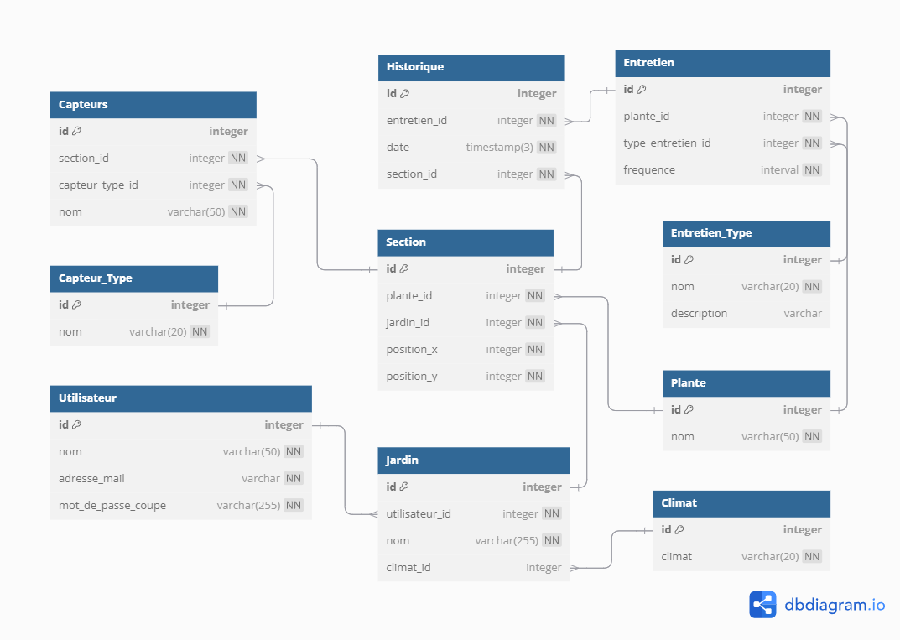

# Avalgard - Garden Management System

## Organisation / Situation
Avalgard est un système de gestion de jardin permettant aux utilisateurs d’optimiser leurs activités de jardinage. Le système repose sur une base de données relationnelle qui structure les informations liées aux plantes, aux sections de jardin, aux capteurs, et aux activités d’entretien. Cette approche permet une gestion précise et personnalisée de chaque jardin.

## Quelques Métriques
- Le système peut suivre jusqu’à 50 plantes différentes par jardin.
- Il prévoit des mises à jour automatiques basées sur des données climatiques locales.
- Intègre des capteurs pour mesurer la température, l’humérité et la luminosité.

## Particularités de la Situation
La table Historique est central pour la planification des différents entretiens à réaliser sur les plantes. Grâce à la fréquence et à la date des entretiens réalisé nous pouvons déterminer un historique des entretiens effectués ansi qu'une planification des futures. Les capteurs jouerons égalment un rôle crucial afin de déterminer à quelle fréquence certaines tâches devront être effectuées.

## Challenges Attendues
- **Modélisation des besoins des plantes** : chaque plante a des exigences uniques (arrosage, température, etc.).
- **Optimisation des entretiens** : planification des tâche à réaliser à l'aide de la fréquence des entretiens.

## Aspects Modélisés / Non Modélisés
- **Modélisés** :
  - Gestion des plantes et de leurs sections associées.
  - Suivi des activités d’entretien et des historiques.
  - Intégration des climats pour ajuster les recommandations.

## Exemples de demandes
De nombreuses demandes peuvent être faites, comme par exemple :
- La liste des plantes avec leurs entretiens.
- Le nombre de plantes par jardin.
- La liste des capteurs.
- La liste des entretiens en cours et dans combien de temps ils devront être effectués.
- L'historique des entretiens.
- Le nombre de plantes par section.

## Limites de la Base de Données
Bien que la base de données d'Avalgard couvre de nombreux aspects de la gestion de jardin, certaines limitations et sujets ne sont pas traités :

- **Gestion des maladies et des parasites** : La base de données ne prend pas en compte les maladies spécifiques des plantes ou les infestations de parasites, ce qui pourrait affecter la santé des plantes et nécessiter des interventions spécifiques.
- **Planification des ressources** : La base de données ne modélise pas la gestion des ressources nécessaires pour l'entretien des jardins, comme l'eau, les engrais ou les outils de jardinage.
- **Interaction sociale** : Il n'y a pas de fonctionnalités pour permettre aux utilisateurs de partager leurs expériences de jardinage ou d'interagir avec d'autres jardiniers.
- **Personnalisation avancée** : Les préférences spécifiques des utilisateurs concernant les types d'entretien ou les méthodes de jardinage ne sont pas prises en compte.

Ces limitations peuvent être des pistes d'amélioration pour de futures versions du système, afin d'offrir une solution plus complète pour la gestion des jardins.

## Familiarité et Motivation
Nous avons choisi ce thème, car dans le cadre du cours de génie logiciel, nous devons réaliser une web app sur la gestion de jardin.

## Données Disponibles
Les données sur les plantes (humidité, fréquence d'arosage, information de la plante, etc...) sont facilement trouvable sur internet.
